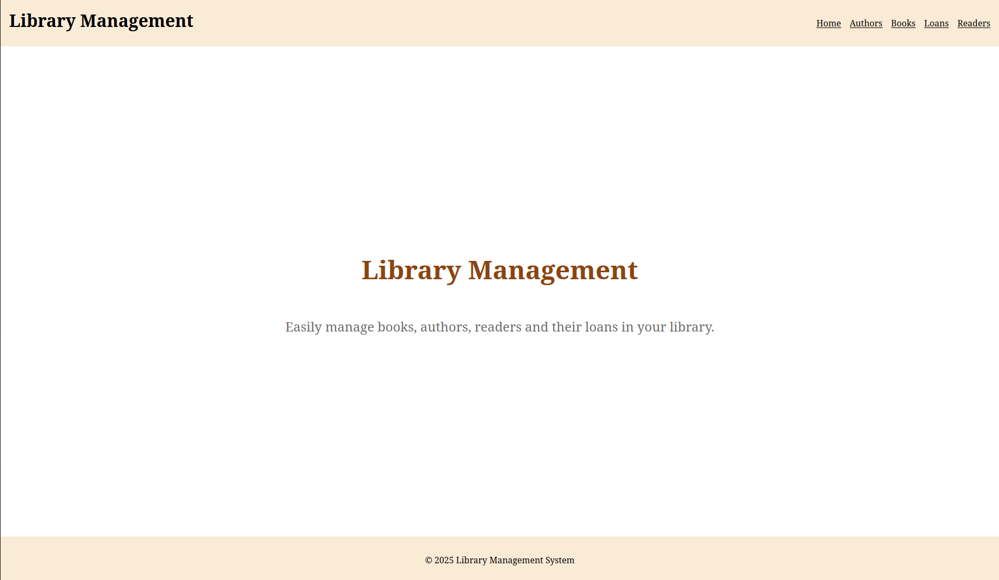
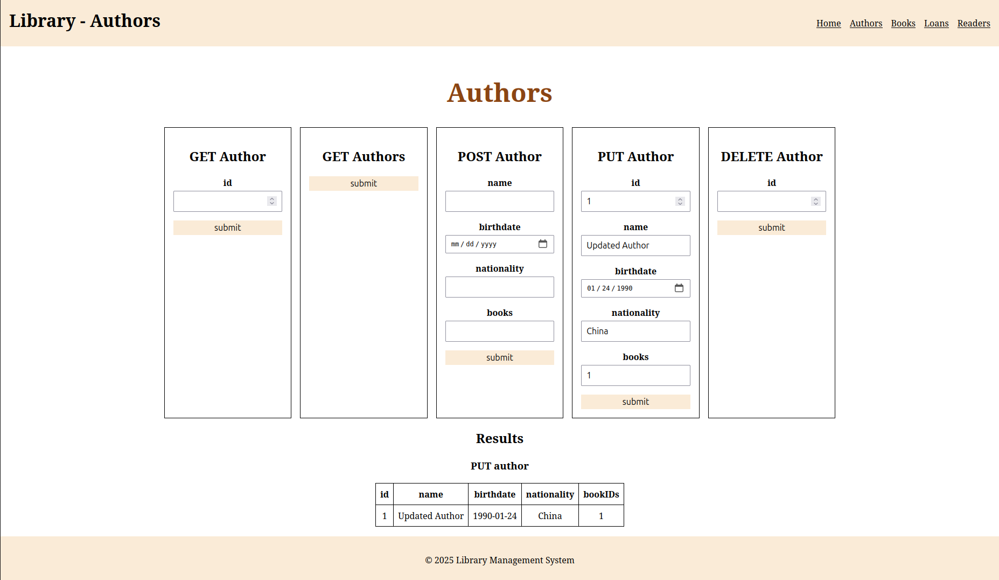
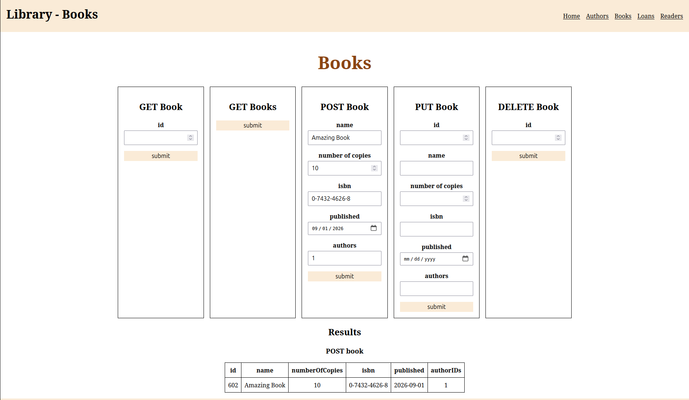
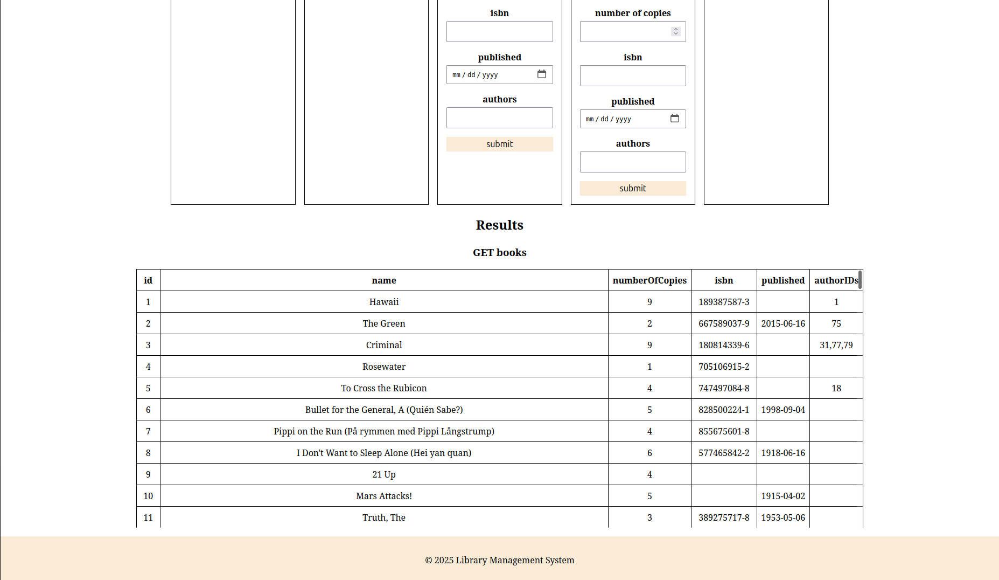
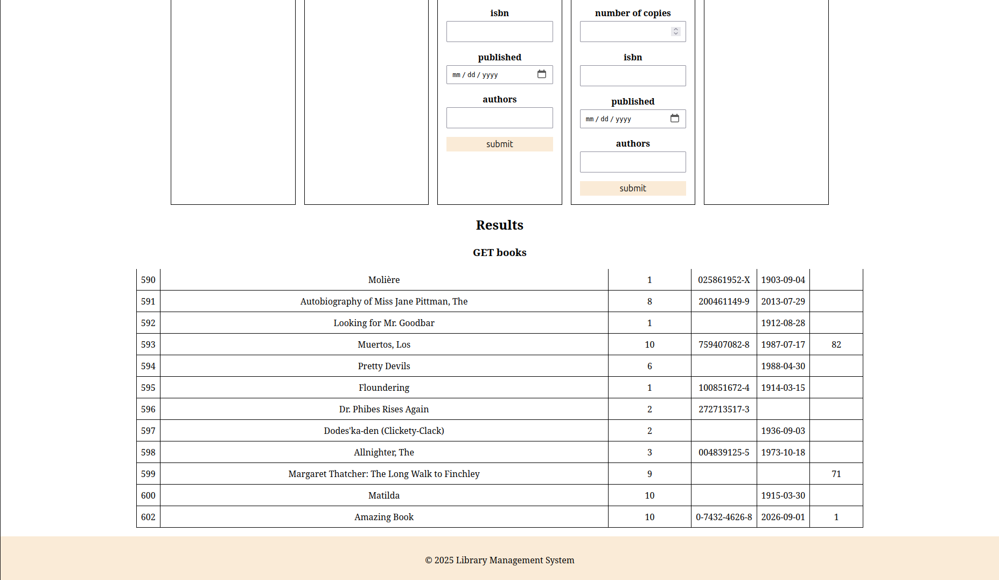
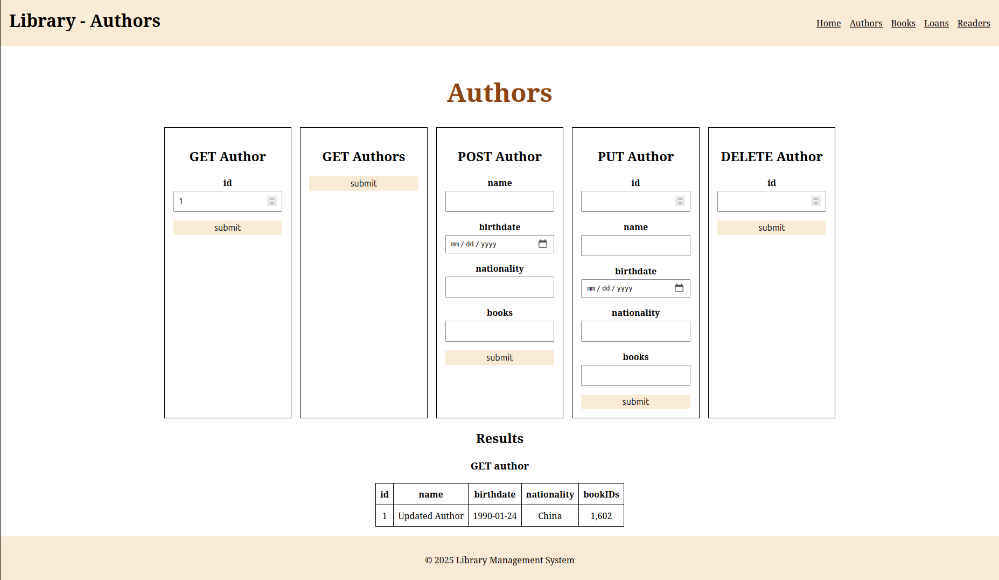
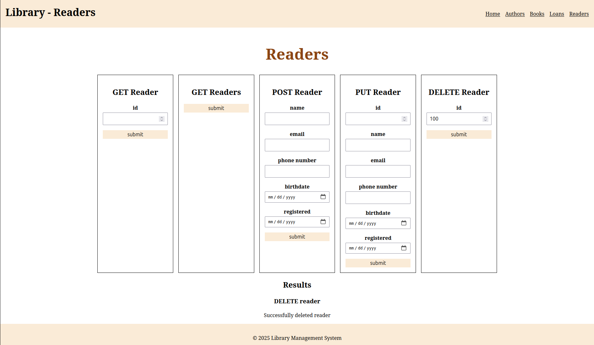
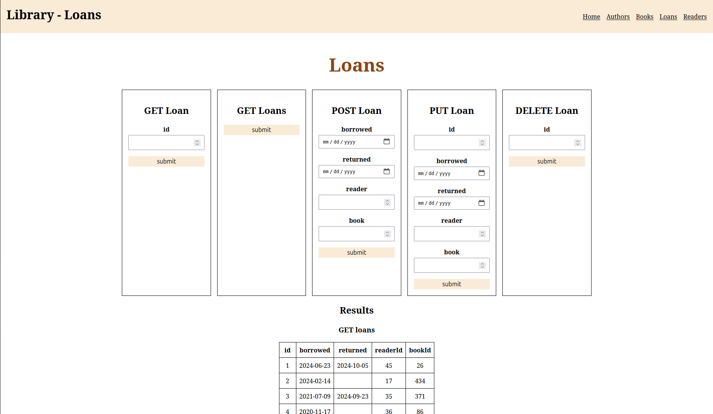

# Library Management System

Java library management application for managing books, authors, readers and loans, with a lightweight browser client for interacting with the data.



## Features

- CRUD operations for authors, books, readers and loans
- Relationships between authors and books, readers and loans
- Persistence with Spring Data JPA and Hibernate
- Centralized error handling for API requests
- CORS configuration for the separate frontend
- Sample database data in `server/src/main/resources/insert.sql`

## Technology stack

| Area | Technology |
| --- | --- |
| Language | Java |
| Backend | Spring Boot, Spring Web |
| Persistence | Spring Data JPA, Hibernate |
| Database | PostgreSQL |
| Build | Gradle |
| API documentation | Springdoc OpenAPI, Swagger UI |
| Frontend | HTML, CSS and vanilla JavaScript |
| Testing | JUnit, Spring Boot Test |

## Architecture

The project is split into two main parts:

- `server/` — Java backend with REST API and persistence layer
- `client/` — static frontend interface for end-user interaction

The backend follows a three layered architecture:

- Controller
- Service
- Repository

## Data model

The domain model is centered around four core entities:

- Authors
- Books
- Readers
- Loans


## REST API

The application exposes a RESTful API for each main resource:

| Resource | Base path |
| --- | --- |
| Authors | `/authors` |
| Books | `/books` |
| Readers | `/readers` |
| Loans | `/loans` |

Supported operations include:

- `GET /resource`
- `GET /resource/{id}`
- `POST /resource`
- `PUT /resource/{id}`
- `DELETE /resource/{id}`

After the backend is running, API documentation is available at:

```text
http://localhost:8080/swagger-ui/index.html
```

## Run application

### Prerequisites

- JDK 17 or newer
- Docker Desktop with PostgreSQL, or a local PostgreSQL installation
- Python 3 for serving the static client

### 1. Configure the database

Create a PostgreSQL database named `library` and ensure it is running on port `5432`.

The connection settings are defined in `server/src/main/resources/application.properties`. In the current project configuration the default local credentials are `user` / `123456`, update them if your local PostgreSQL setup differs.

### 2. Run the backend

From the project root, run:

```bash
./gradlew.bat bootRun
```

The API will start on:

```text
http://localhost:8080
```

To execute the automated test suite:

```bash
./gradlew.bat test
```

You can also run the same tasks directly from IntelliJ or another IDE.

### 3. Start the frontend

In a second terminal, serve the `client` directory:

```bash
cd client
python -m http.server 1234
```

Open `http://localhost:1234` in a browser. The client provides separate views for authors, books, readers and loans.

## Examples

The screenshots demonstrate how the application can be used to inspect and modify related library data.

### 1. Get an author

Retrieve the author with ID 1:


### 2. Update an author

Modify the information about the author with ID 1:



### 3. Create a book

Create a new book and associate it with the author with ID 1:



### 4. List all books

Verify that the new book is available through the books endpoint:





### 5. Verify the author-book relationship

Retrieve the author again and confirm that the new book is associated with the author:



### 6. Delete a reader

Delete the reader with ID 100:



### 7. List all loans

Retrieve the current loans from the library:


