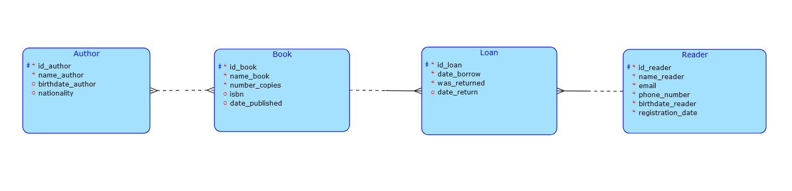

# Library
Spravuji databázový systém knihovny, který uchovává a spravuje informace o knihách, autorech, čtenářích a jejich výpůjčkách. Jednoduché uživatelské rozhraní je navrženo tak, aby usnadnilo knihovníkům i čtenářům přístup k potřebným funkcím pro správu a využívání knihovních služeb.
## Schéma

## Dotaz
Uživatel vybere knihu, systém ověří, zda je kniha dostupná, a popřípadě ji umožní vypůjčit.
## Servery
### PostgreSQL server
Pro správu databáze používám PostgreSQL běžící v Docker Desktop kontejneru, který je nastavený na portu 5432. Tento server slouží pro uchovávání všech relevantních dat knihovního systému.
### HTTP server
Pro vývojovou verzi klientské aplikace používám jednoduchý HTTP server spuštěný ve složce klienta pomocí příkazu: "python3 -m http.server 1234". Tento server běží na portu 1234 a slouží pro interakci serveru s uživatelem.